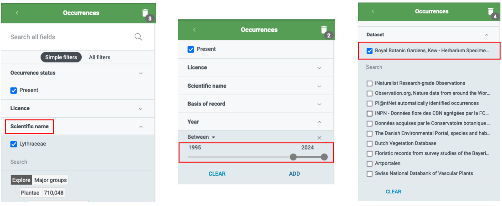
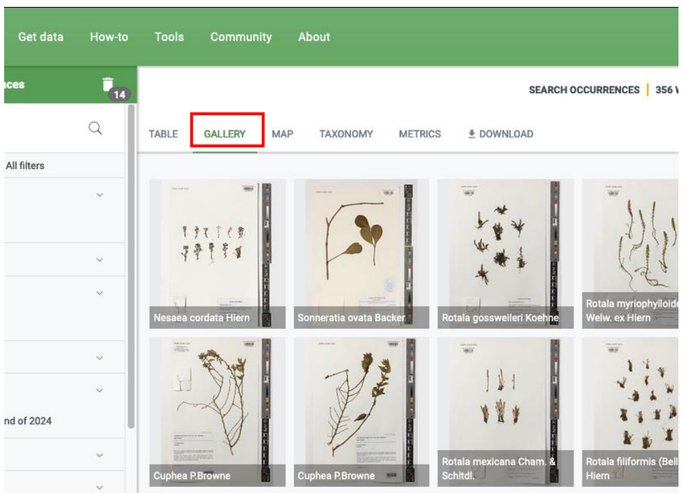
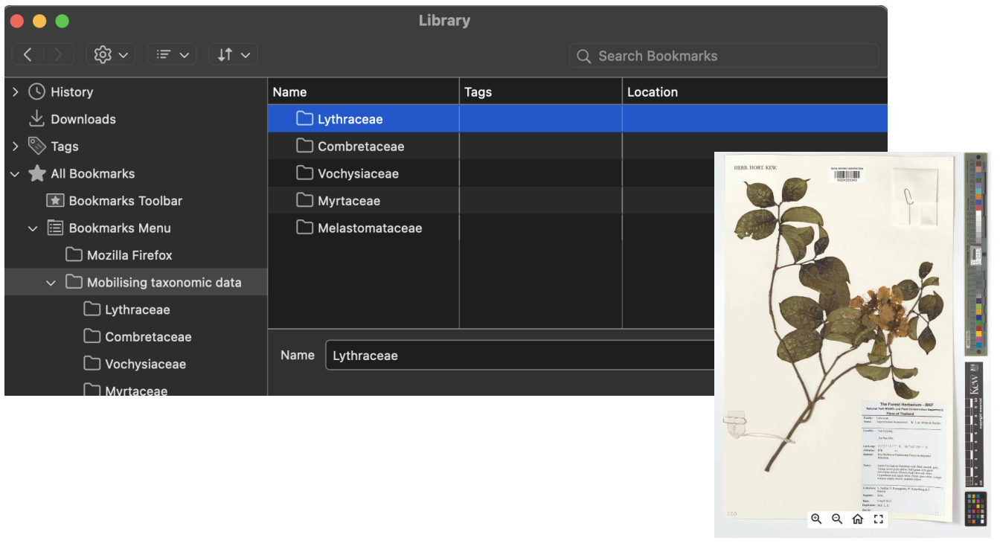
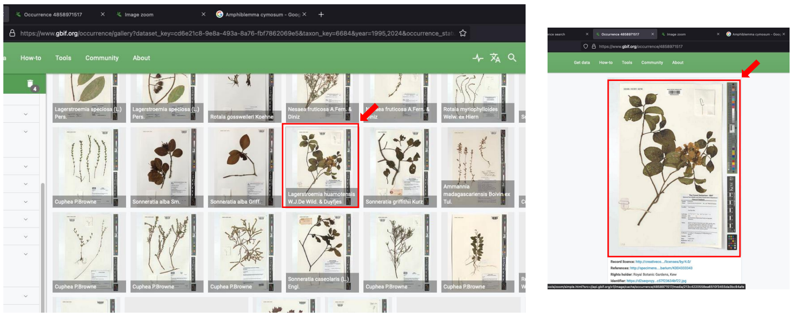

## Mobilising Traits Protocol

> ###### *Lythraceae* example

---

### Filtering of Image Specimen

- The specimen image at GBIF &rarr; OCCURRENCES

- Setting the filters
    - **Scientific name** &rarr; *Lythraceae*
    - **Year** &rarr; 1995 to 2024
    - **Dataset** &rarr; Kew Herbarium

- If necessary, select the tropical **Country or area**

- To show the resources, click **GALLERY**

---

### Creating Bookmarks in Firefox

- **Ctrl + Shift + O** &rarr; showing the small window
- Add new bookmark. **'Mobilising Taxonomic Data'**
- Add new folder of family

---

### Mobilising Traits

- Clicking the file in **GALLERY** to **Specimen page** then clicking image to **Image page**
- **Ctrl + D** &rarr; Editing bookmark and adding the right **Tags**
- Selecting the characters **tags**

- if the characters are not in list, type new tags directly

- Different symbols in tags
    - No symbol: the characters are described in **'Key characters'** and **'Spot Characters'** of the handbook
    - #: the characters are described in the **'Main description'** of the handbook
    - %: the characters are described in the **label** of specimen (mostly habitat)

---

### Export Bookmarks

- **Ctrl + Shift + O** &rarr; showing the small window
- Selecting the bookmarks **'Mobilising taxonimic data'**
- **Export Bookmarks to HTML files**

 
